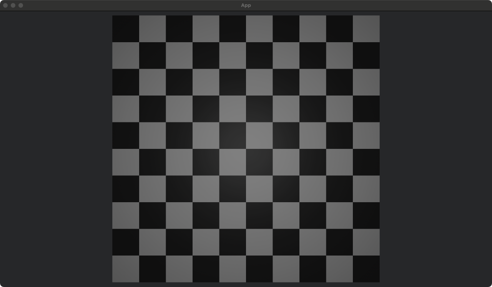

# Bevy Card3d Kit

Notes: 项目实验性内容，版本更新较快。不分特新不兼容。

# 使用方法

### 基本卡片渲染

1. 引入插件

```rust
fn main() {
    App::new()
        .add_plugins((
            DefaultPlugins,
            // 添加这个插件
            Card3DPlugins))
        // .add_plugins(WorldInspectorPlugin::new())
        .add_systems(Startup, setup)
        .add_systems(Update, rotate_entities)
        .run();
}

```

2. 建立数据类型 并实现正反面的方法

```rust
#[derive(Component, Clone)]
pub struct CardInfo {
    pub name: String,
}

impl CardMaterialGetter for CardInfo {
    fn get_face_mal(
        &self,
        materials: &mut ResMut<Assets<StandardMaterial>>,
        asset_server: &Res<AssetServer>,
    ) -> Handle<StandardMaterial> {
        materials.add(StandardMaterial {
            base_color: Color::WHITE,
            unlit: true,
            base_color_texture: Some(asset_server.load(format!("cards/{}.png", self.name))),
            alpha_mode: AlphaMode::Blend,
            ..Default::default()
        })
    }

    fn get_back_mal(
        &self,
        materials: &mut ResMut<Assets<StandardMaterial>>,
        asset_server: &Res<AssetServer>,
    ) -> Handle<StandardMaterial> {
        materials.add(StandardMaterial {
            base_color: Color::WHITE,
            unlit: true,
            base_color_texture: Some(asset_server.load(format!("cards/{}.png", "back"))),
            alpha_mode: AlphaMode::Blend,
            ..Default::default()
        })
    }
}


pub struct SimplePlugin;

impl Plugin for SimplePlugin {
    fn build(&self, app: &mut App) {
        bind_card_render::<CardInfo>(app);
    }
}
```

3. 之后即可使用

```rust
fn setup(mut commands: Commands) {
    // 相机
    commands.spawn((
        SharkCamera,
        Camera3d::default(),
        Transform::from_xyz(0., 0., 15.).looking_at(Vec3::ZERO, Vec3::Y),
    ));

    // 光源
    commands.spawn((
        PointLight {
            shadows_enabled: true,
            ..default()
        },
        Transform::from_xyz(0.0, 0.0, 10.0),
    ));
    commands.spawn((
        Rotating,
        CardInfo {
            name: "NAAI-A-001".to_string(),
        },
        Card {
            origin: Transform::from_xyz(0.0, 0.0, HAND_CARD_LEVEL),
        },
    ));
}
```

### 使用手牌

使用 CardLine组件创建手牌线实体
然后再手牌上挂载HandCard实体

```rust
fn setup(mut commands: Commands) {
    // 相机
    commands.spawn((
        SharkCamera,
        Camera3d::default(),
        Transform::from_xyz(0., 0., 25.).looking_at(Vec3::ZERO, Vec3::Y),
    ));

    // 光源
    commands.spawn((
        PointLight {
            shadows_enabled: true,
            ..default()
        },
        Transform::from_xyz(0.0, 0.0, 10.0),
    ));
    let card_list = [
        "NAAI-A-001",
        "NAAI-A-001",
        "NAAI-A-001",
        "S001-A-001",
        "S001-A-001",
        // "S001-A-001",
    ];
    let card_line_entity = commands
        .spawn(CardLine {
            transform: Transform::from_xyz(0.0, -6.7, HAND_CARD_LEVEL),
            card_list: vec![],
        })
        .id();

    // 加载手卡
    card_list.iter().for_each(|name| {
        commands.spawn((
            Card {
                origin: Transform::default(),
            },
            CardInfo {
                name: name.to_string(),
            },
            Moveable,
            HandCard {
                belong_to_card_line: Some(card_line_entity),
            },
        ));
    });
}
```

## 场地

定义一个场地类型

```rust
#[derive(Clone, Debug, Component)]
enum CardZone {
    TypeA,
    TypeB,
}

impl ZoneMaterialGetter for CardZone {
    fn get_mal(
        &self,
        materials: &mut ResMut<Assets<StandardMaterial>>,
        _asset_server: &Res<AssetServer>,
    ) -> Handle<StandardMaterial> {
        match self {
            CardZone::TypeA => materials.add(Color::BLACK),
            CardZone::TypeB => materials.add(Color::WHITE),
        }
    }
}
```

bind 类型到渲染插件中

```rust
fn main() {
    App::new()
        .add_plugins((DefaultPlugins, Card3DPlugins))
        // .add_plugins(WorldInspectorPlugin::new())
        .add_systems(Startup, setup)
        .add_plugins(|app: &mut App| {
            ///!!!!!! 这里！
            bind_zone_render::<CardZone>(app);
        })
        .run();
}
```

之后直接只用Zone组件和 我们新电影的组件CardZone即可

```rust
/// 行数 列数 和 正方形的宽 生成列表
fn render_gen_zone_render(commands: &mut Commands, row: usize, col: usize, a: f32) {
    for r in 0..row {
        for c in 0..col {
            let center = Transform::from_xyz(
                c as f32 * a - (col - 1) as f32 * a / 2.0,
                r as f32 * a - (row - 1) as f32 * a / 2.0,
                0.0,
            );
            commands.spawn((
                Zone {
                    // 位置
                    center,
                    // 大小
                    size: Vec2::new(a, a),
                },
                if ((r + c * a.floor() as usize) % 2) == 0 {
                    CardZone::TypeB
                } else {
                    CardZone::TypeA
                },
            ));
        }
    }
}

```

## 放置卡片到Zone上 && 放置卡片到卡片上

```rust
#[derive(Event, Clone, Debug)]
pub struct CardOnZone {
    pub card: Entity,
    pub zone: Entity,
}

// 卡片进入到卡片上
#[derive(Event, Clone, Debug)]
pub struct CardOnCard {
    pub bottom_card: Entity,
    pub top_card: Entity,
}

```

用户可以写自己的 Observer进行处理。详细可见example中的示例

## 卡片姿态

给下组件的实体添加CardState用来控制卡片的显示姿态

- Card
- HandCard
- DeskZone
- [ ] Zone

> Zone 需要监听CardOnZone Observer 而后自己对对象进行操作（后续可能会有默认的操作）

# 示例

| example               | desc            |
|-----------------------|-----------------|
| simple                | 基础使用            |
| hand_card             | 手牌(新版)          |
| zone                  | 场地基础            |
| card_on_zone          | 卡片放置到不同的场地上（新版） |
| card_on_card          | 卡片放到卡片上         |
| card_preview          | 预览图片的特性         |
| desk_simple           | 简单的放置卡组         |
| hand_card_with_state) | 两组手牌 使用卡片姿态控制   |
| effect_cut            | 效果无效时动画         |

simple.rs

https://github.com/user-attachments/assets/892158c5-2788-4906-a22a-7fca0f820ec9

hand_card.rs

https://github.com/user-attachments/assets/124294e4-1d45-40a7-8c49-8dcf29eaf198

zone.rs


card_on_zone.rs 简单的实例 拖拽到不同的位置进行不同的处理。

https://github.com/user-attachments/assets/4490abbf-29ee-4af9-824a-74af213052c3

# 版本

| bevy | bevy_card3d_kit |
|------|-----------------|
| 0.15 | 0.1.3           |
| 0.16 | TODO            |

# TODO LIST

- Feature：更好的Desk初始化问题
- FIX: 更好的手牌位置算法。
- Feature: 拖拽时的 Zone交互
- Feature: 攻击时交互。攻击线,攻击动画。攻击发生后的AttackEvent
- Feature: 破坏时特效。
- Feature: 墓地Zone
- ~~Feature: 效果无效时的动画~~
- Feature: 一套可用的交互UI
- Feature: Zone信息查看的基本内容（疑问 是否应该在插件内做。还是应该在具体项目内实现）
- Feature: 基础UI（名字血量等）
- Feature: 暴雨的粒子特效
- Feature: 基础音效！Rock!Rock!Rock!
- Document: English Version document.More Official doc for rust code.

ForGame:

- 实现理性区和激情区的Zone
- 实现准备区和安全屋(可以放置卡的位置)的Zone

# 鸣谢

感谢 Wechat群Bevy引擎学习交流

感谢 Rabbival 和它的仓库 bevy_play_card

如果你要开发2d的卡片游戏可以参考他的项目
https://github.com/Rabbival/bevy_play_card

# Change Log

## 0.1.3

- feature 支撑卡片姿态。来控制显示的数据是何种类

## 0.1.2

- featrue 支撑HandCard的数据驱动
- 新增了Desk相关代码【实验性】
- Fix 手牌更新位置时bug

## 0.1.1

- featrue Card 和 Zone 数据驱动
- 0.1.0 Init